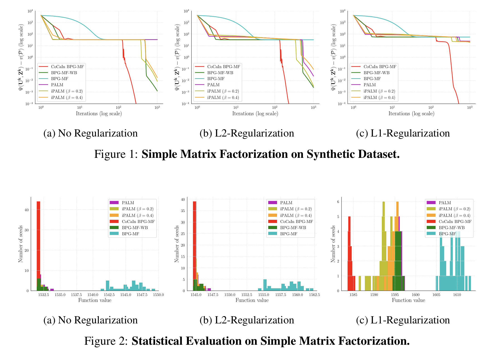
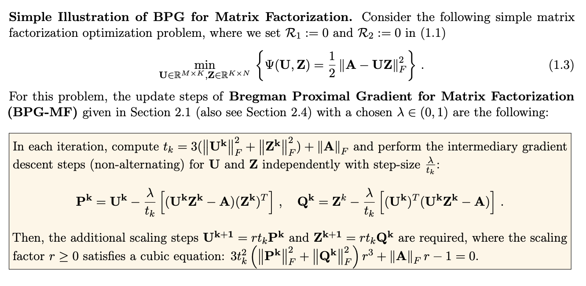

## New Fast Non-Alternating Inertial Matrix Factorization Algorithms

## [Beyond Alternating Updates for Matrix Factorization with Inertial Bregman Proximal Gradient Algorithms](https://arxiv.org/abs/1905.09050) 
by Mahesh Chandra Mukkamala and Peter Ochs, Mathematical Optimization Group, Saarland University.

### [Part 2: Matrix Completion Code](https://github.com/mmahesh/cocain-bpg-matrix-completion) 

## Algorithms Implemented:

**BPG-MF**: Bregman Proximal Gradient (BPG) for  Matrix Factorization  
**CoCaIn BPG-MF**: Convex Concave Inertial (CoCaIn) BPG for Matrix Factorization  
**BPG-MF-WB**: BPG for Matrix Factorization with Backtracking  
**PALM**: Proximal Alternating Linearized Minimization  
**iPALM**: Inertial Proximal Alternating Linearized Minimization  

### Dependencies
- numpy, matplotlib and nimfa

If you have installed above mentioned packages you can skip this step. Otherwise run  (maybe in a virtual environment):

    pip install -r requirements.txt

## Reproduce results

To generate results 

    python run_automated.py 

Then to create the plots
    
    chmod +x generate_plots.sh
    ./generate_plots.sh

To generate statistical evaluation results 

    python run_seed_exps.py 

Then to create the plots
    
    chmod +x generate_seed_plots.sh
    ./generate_seed_plots.sh

Now you can check **figures** folder for various figures. 

## Description of results

The function number is denoted as **fun_num**. The plots corresponding to **fun_num**  0,1,2 are for synthetic dataset. And, the plots corresponding to Medulloblastoma dataset are denoted with **fun_num**  3,4,5.

In **fun_num**  0,3 : No-Regularization is used.  
In **fun_num**  1,4 : L2-Regularization is used.  
In **fun_num**  2,5 : L1-Regularization is used.  

## Results

## Simple Illustration
An excerpt from Page 2 of the [paper](https://arxiv.org/abs/1905.09050). 

## Citation

    @techreport{MO19b,
      title        = {Beyond Alternating Updates for Matrix Factorization with Inertial Bregman Proximal Gradient Algorithms},
      author       = {M.C. Mukkamala and P. Ochs},
      year         = {2019},
      journal      = {ArXiv e-prints, arXiv:1905.09050},
    }

## Contact 
Mahesh Chandra Mukkamala (mukkamala@math.uni-sb.de)

## References

M.C. Mukkamala, P. Ochs: Beyond Alternating Updates for Matrix Factorization with Inertial Bregman Proximal Gradient Algorithms. ArXiv e-prints, arXiv:1905.09050, 2019. 

M. C. Mukkamala, P. Ochs, T. Pock, and S. Sabach: Convex-Concave Backtracking for Inertial Bregman Proximal Gradient Algorithms in Non-Convex Optimization. ArXiv e-prints, arXiv:1904.03537, 2019.

J. Bolte, S. Sabach, M. Teboulle, and Y. Vaisbourd. First order methods beyond convexity and Lipschitz gradient continuity with applications to quadratic inverse problems. SIAM Journal on Optimization, 28(3):2131–2151, 2018.

J. Bolte, S. Sabach, and M. Teboulle. Proximal alternating linearized minimization for nonconvex and nonsmooth problems. Mathematical Programming, 146(1-2):459–494, 2014.

T. Pock and S. Sabach. Inertial proximal alternating linearized minimization (iPALM) for nonconvex and nonsmooth problems. SIAM Journal on Imaging Sciences, 9(4):1756–1787, 2016.

## License

[Check here.](LICENSE)

